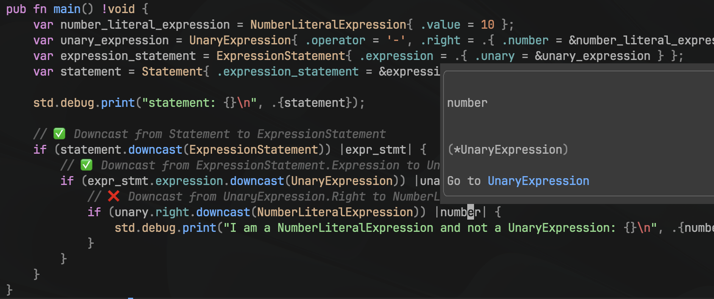

# ZLS Hover Information Bug Reproduction

## Overview

This repository contains a minimal Zig code example that demonstrates an issue with Zig Language Server (ZLS) providing incorrect type information on hover for a specific case involving union downcasting.

The bug has been spotted on zig version `0.12.0-dev.2500+c085c6ecd` and zls version `0.12.0-dev.365+a8a83b6`.

## Issue Description

In the provided Zig code, when attempting to downcast from `UnaryExpression.Right` to `NumberLiteralExpression`, the expected type on hover should be `*NumberLiteralExpression`. However, ZLS incorrectly displays it as `*UnaryExpression`.

See image below:


As shown in the screenshot above, the hover information incorrectly indicates the type as `*UnaryExpression` instead of `*NumberLiteralExpression`.

## Steps to Reproduce

1. Clone this repository.
2. Open the project in your preferred Zig development environment that utilizes ZLS.
3. Hover over the variable `number` in the `main` function to observe the type information provided by ZLS.
4. You can execute the code to see that zig is evaluating the downcast accordingly.

## Expected Behavior

The hover information for `number` should indicate its type as `*NumberLiteralExpression`.

## Actual Behavior

The hover information for `number` incorrectly indicates its type as `*UnaryExpression`.

## Environment

- Zig version: 0.12.0-dev.2500+c085c6ecd
- ZLS version: 0.12.0-dev.365+a8a83b6
- OS: MacOS M1 Pro 2020 Sonoma 14.2.1

## Code Snippet

```zig
// ✅ Downcast from Statement to ExpressionStatement
if (statement.downcast(ExpressionStatement)) |expr_stmt| {
    // ✅ Downcast from ExpressionStatement.Expression to UnaryExpression
    if (expr_stmt.expression.downcast(UnaryExpression)) |unary| {
        // ❌ Downcast from UnaryExpression.Right to NumberLiteralExpression
        if (unary.right.downcast(NumberLiteralExpression)) |number| {
            std.debug.print("I am a NumberLiteralExpression and not a UnaryExpression: {}\n", .{number});
        }
    }
}
```
